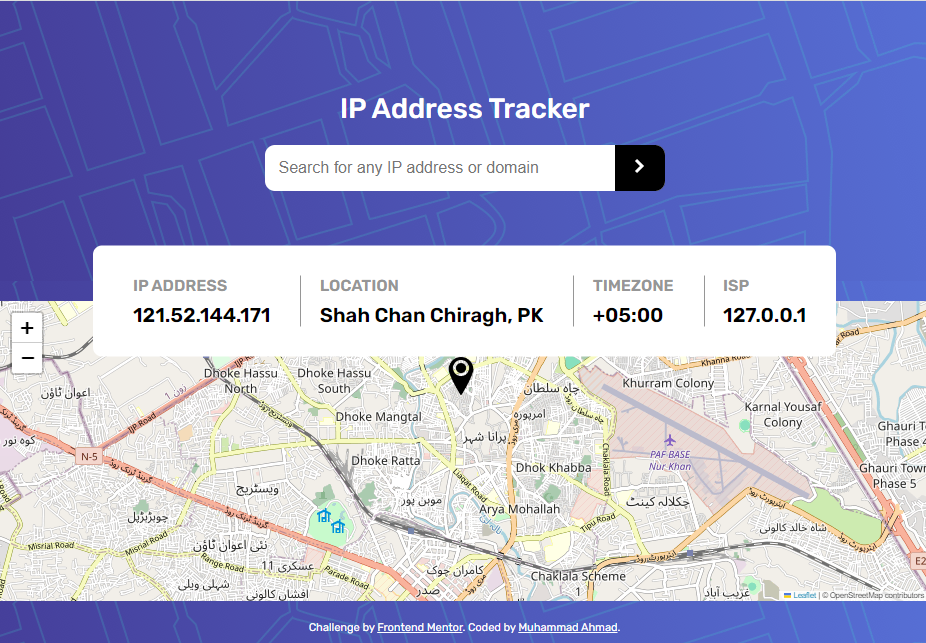
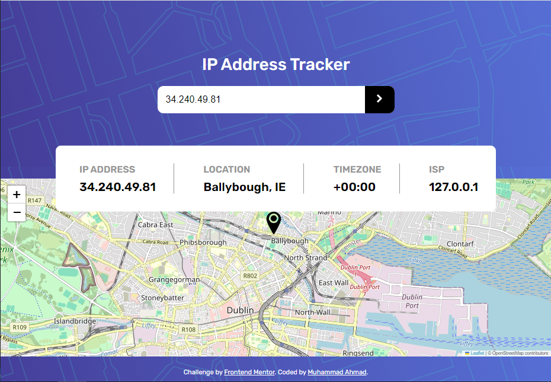
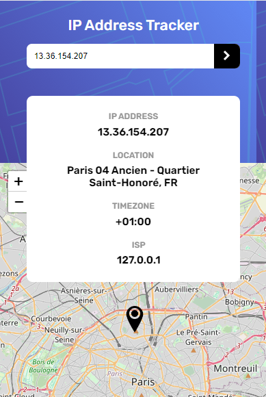

# Frontend Mentor - IP address tracker solution

This is a solution to the [IP address tracker challenge on Frontend Mentor](https://www.frontendmentor.io/challenges/ip-address-tracker-I8-0yYAH0). Frontend Mentor challenges help you improve your coding skills by building realistic projects.

### Screenshot

### Links

- Solution URL: [SEE solution URL here](https://github.com/muhammad-ahmad66/ip-address-tracker)
- Live Site URL: [SEE live site URL here](https://muhammad-ahmad66.github.io/ip-address-tracker/)

### Built with

- Semantic HTML5 markup
- CSS custom properties
- Flexbox
- CSS Grid
- Mobile-first workflow
- [leaflet library](https://leafletjs.com/) - An API
- [geo IPIfy](https://geo.ipify.org/)

## Author

- [Muhammad Ahmad](https://github.com/muhammad-ahmad66/)
- Frontend Mentor - [@muhammad-ahmad66](https://www.frontendmentor.io/profile/muhammad-ahmad66)
